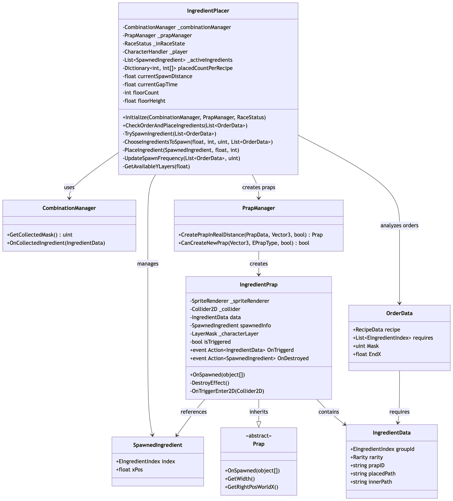
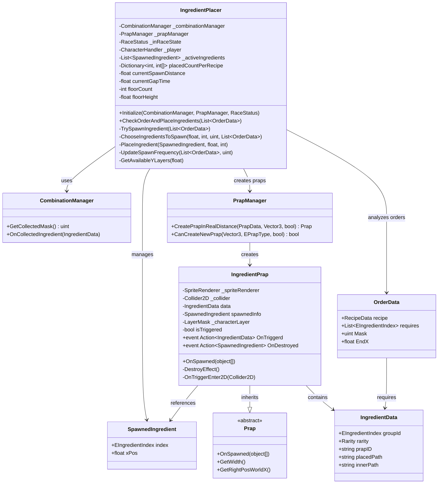

## 25.07.18 포트폴리오 작성

### 작업 목표

이직 준비를 위해서 현 프로젝트의 아래의 내용을 '본문' 내용에 정리해야함

- 주요한 파트를 추리기
- 해당 구조로 설계하게 된 배경과 시행착오 등을 깃 히스토리를 통해 확인하고 작성
- 주요한 파트에서 다시 기능들을 분류해 단순화 하여 다이어그램과 간단한 코드, 설명으로 작성
- 해당 구조 변경 후 차이를 보여주기 위해 이전 시점의 커밋 시점을 찾아 플레이 화면 캡쳐

### 본문

---

## 주요 파트 분석 결과

프로젝트 분석을 통해 게임 기능상 가장 중요하고 구조적으로 잘 설계된 **5개 주요 파트**를 선정했습니다:

### 1. **재료 배치 시스템 (Ingredient Placement System)**

- **핵심 클래스**: `IngredientPlacer.cs`, `IngredientPrap.cs`
- **주요 특징**:
  - 동적 빈도 조절을 통한 게임 밸런스 최적화
  - 비트마스크 활용한 효율적인 재료 조합 시스템
  - 장애물 회피 로직과 층별 배치 시스템

### 2. **재료 조합 및 오더 처리 시스템 (Combination & Order System)**

- **핵심 클래스**: `CombinationManager.cs`, `OrderSystem.cs`, `RecipeDatas.cs`
- **주요 특징**:
  - 비트마스크 기반 효율적인 재료 조합 확인
  - 오더 생성부터 서빙까지의 전체 라이프사이클 관리
  - 레시피 대기열 시스템과 동적 오더 생성

### 3. **레이어 별 화면 플로우와 오브젝트 배치 시스템 (Layer-based Flow & Object Management)**

- **핵심 클래스**: `FlowLayer.cs`, `SpawnLayer.cs`, `PrapManager.cs`, `FlowManager.cs`
- **주요 특징**:
  - 패럴랙스 효과를 위한 레이어별 차등 이동 시스템
  - 화면 영역 기반 동적 오브젝트 생성/제거로 메모리 최적화
  - 플레이어 속도 적응형 오브젝트 간격 조절
  - 계층별 독립적인 프랍 관리 시스템

### 4. **캐릭터 제어 및 충돌 처리 시스템 (Character Control & Collision System)**

- **핵심 클래스**: `CharacterHandler.cs`, `Character.cs`
- **주요 특징**:
  - 레이어 기반 정밀한 충돌 감지 (바닥, 장애물, 데드존 구분)
  - 물리 기반 이동과 점프 시스템
  - 재료 수집 및 장애물과의 상호작용 처리
  - 게임 상태에 따른 캐릭터 행동 제어

### 5. **UI 시스템 및 실시간 피드백 (UI System & Real-time Feedback)**

- **핵심 클래스**: `OrderUI.cs`, `OrdersUI.cs`, `IngredientsInKimbapUI.cs`
- **주요 특징**:
  - DOTween 기반 복잡한 오더 UI 애니메이션 시스템
  - 실시간 재료 배치 미리보기 및 조합 확인
  - 오더 생명주기 시각화 (남은 시간 표시)
  - 사용자 경험을 위한 직관적인 피드백 시스템

## **재료 배치 시스템**

재료 배치 시스템은 플레이어가 수집할 재료들을 게임 월드에 동적으로 배치하는 핵심 시스템입니다. 단순한 랜덤 생성이 아닌, 현재 활성화된 오더와 플레이어의 수집 상태, 게임 진행 속도를 고려하여 지능적으로 재료를 배치합니다.

**주요 특징:**

- **동적 빈도 조절**: 게임 상황에 따라 재료 생성 빈도를 실시간으로 조절
- **비트마스크 최적화**: 재료 조합 확인을 위한 효율적인 비트 연산 활용
- **장애물 회피**: 기존 장애물과 겹치지 않는 위치에 재료 배치
- **층별 배치**: Y축 층 구조를 통한 다양한 배치 패턴 제공
- **메모리 최적화**: 화면 밖 재료 자동 제거로 성능 최적화

### 설계 배경 및 시행착오

### 클래스 다이어그램





**주요 클래스 관계:**

- **IngredientPlacer**: 재료 배치 로직의 중심 클래스로, 오더 분석 후 적절한 재료를 선택하고 배치
- **SpawnedIngredient**: 생성된 재료의 메타데이터를 관리하는 데이터 클래스
- **IngredientPrap**: 실제 게임 월드에 배치되는 재료 오브젝트, 플레이어와의 상호작용 처리
- **CombinationManager**: 비트마스크 기반 재료 조합 확인 및 수집 상태 관리
- **PrapManager**: 프랍 생성 및 배치 위치 검증을 담당하는 팩토리 클래스

### 주요 기능 설명 및 코드 예시

재료 배치 시스템은 다음 4개의 핵심 기능으로 구성됩니다:

#### 1. **지능적 재료 선택 (Smart Ingredient Selection)**

현재 활성화된 오더와 플레이어의 수집 상태를 분석하여 가장 필요한 재료를 우선 배치합니다.

```csharp
List<int> ChooseIngredientsToSpawn(float curX, int maxCount, uint collectedMask, List<OrderData> activeRecipes)
{
    // 점수 기반 재료 선택 시스템
    float[] score = new float[totalIngredientCount];

    for (int i = 0; i < totalIngredientCount; i++)
    {
        uint bit = (1u << i);
        float s = 0f;

        // 부족한 재료에게 높은 점수 부여
        if (missingInAny[i]) s += 100f;

        // 필요 개수만큼 가산점
        s += needCount[i] * 10f;

        // 이미 수집된 재료는 감점
        if ((collectedMask & bit) != 0) s -= 20f;

        // 레시피당 최소 생성 보장
        if (needFirstSpawn) s += 1000f;

        score[i] = s;
    }

    // 점수 내림차순 정렬 후 상위 maxCount개 선택
    return GetTopScoredIngredients(score, maxCount);
}
```

#### 2. **동적 생성 빈도 조절 (Dynamic Spawn Frequency)**

게임 상황에 따라 재료 생성 빈도를 실시간으로 조절하여 게임 밸런스를 유지합니다.

```csharp
private void UpdateSpawnFrequency(List<OrderData> activeRecipes, uint collectedMask)
{
    // 부족한 재료 비율 계산
    float missingRatio = CalculateMissingIngredientRatio(activeRecipes, collectedMask);

    // 활성 레시피 수에 따른 조절
    float recipeCountMultiplier = Mathf.Clamp(activeRecipes.Count / 3f, 0.5f, 2f);

    // 1열 1개 제한 보상 (기존 대비 생성 기회 감소 보상)
    float oneColumnCompensation = 0.6f;

    // 최종 빈도 계산
    float frequencyMultiplier = (1f + missingRatio) * recipeCountMultiplier * oneColumnCompensation;

    // 동적 값 적용
    currentSpawnDistance = Mathf.Clamp(baseSpawnDistance / frequencyMultiplier,
                                     minSpawnDistance, maxSpawnDistance);
    currentGapTime = Mathf.Clamp(baseGapTime / frequencyMultiplier,
                               minGapTime, maxGapTime);
}
```

#### 3. **층별 배치 및 장애물 회피 (Layer Placement & Collision Avoidance)**

Y축 층 구조를 활용하여 다양한 배치 패턴을 제공하고 기존 장애물과 겹치지 않게 배치합니다.

```csharp
private List<int> GetAvailableYLayers(float posX)
{
    Vector3 target = Vector3.right * posX;
    List<int> availableFloors = new();

    // 각 층별 생성 가능 여부 확인
    for (int floor = 0; floor < floorCount; floor++)
    {
        Vector3 curPosition = target + Vector3.up * (floor * floorHeight);

        // 장애물과 겹치지 않는지 확인
        if (_prapManager.CanCreateNewPrap(curPosition, EPrapType.INGREDIENT, true))
        {
            availableFloors.Add(floor);
        }
    }

    // 각 열별 최대 1개 재료 생성 제한
    if (availableFloors.Count > 0)
    {
        // 랜덤하게 1개 층만 선택
        int randomIndex = UnityEngine.Random.Range(0, availableFloors.Count);
        return new List<int> { availableFloors[randomIndex] };
    }

    return new List<int>();
}
```

#### 4. **실제 재료 생성 및 이벤트 연결 (Ingredient Instantiation & Event Binding)**

선택된 재료를 실제 게임 월드에 생성하고 플레이어와의 상호작용을 위한 이벤트를 연결합니다.

```csharp
private void PlaceIngredient(SpawnedIngredient spawnInfo, float posX, int floor)
{
    // 재료 데이터 선택
    EIngredientIndex index = spawnInfo.index;
    List<IngredientData> ingredients = DataContainer.IngredientDatas.GetGroup(index);
    IngredientData ingredientData = ingredients.GetRandomElementsShuffle(1).FirstOrDefault();

    // 위치 계산
    Vector3 placedPosition = new Vector3(posX, floor * floorHeight, 0f);

    // 실제 프랍 생성
    PrapData data = DataContainer.Praps.Get(EPrapType.INGREDIENT, ingredientData.prapID);
    Prap prap = _prapManager.CreatePrapInRealDistance(data, placedPosition, true);

    if (prap is IngredientPrap ingredientPrap)
    {
        // 스폰 정보 전달
        prap.OnSpawned(ingredientData, spawnInfo);

        // 이벤트 연결: 플레이어 충돌 시 수집 처리
        ingredientPrap.OnTriggerd += _combinationManager.OnCollectedIngredient;

        // 제거 시 활성 리스트에서 삭제
        ingredientPrap.OnDestroyed += RemoveIngredient;
    }
}
```

**시스템의 핵심 장점:**

- **점수 기반 우선순위**: 게임 상황에 맞는 재료를 지능적으로 선택
- **실시간 적응**: 플레이어 행동과 게임 진행에 따른 동적 조절
- **성능 최적화**: 비트마스크와 이벤트 기반 처리로 효율적인 연산
- **확장 가능성**: 새로운 재료나 규칙 추가가 용이한 구조

### 결과 비교
